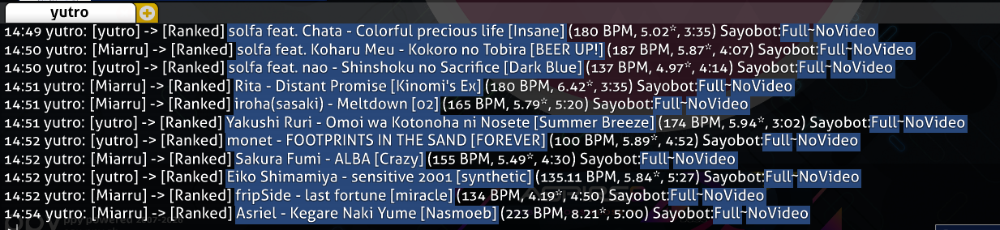
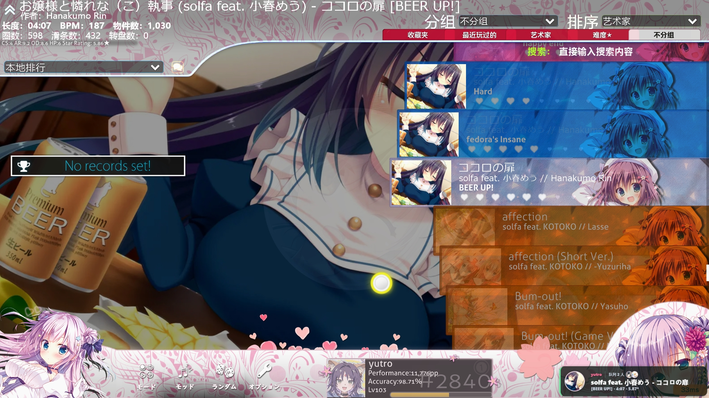
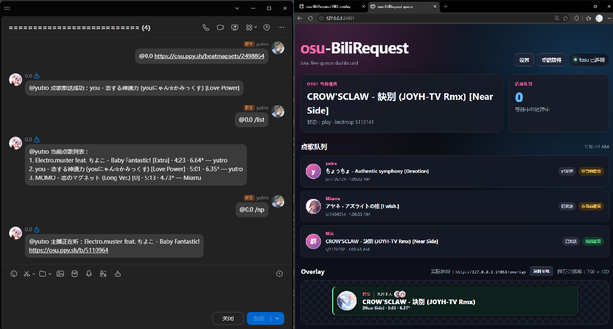

# osu-BiliRequest

<p align="center">
  
</p>

`osu-BiliRequest` 是一个在本机运行的 osu! 点歌工具，可从 bilibili 直播弹幕和 QQ 官方机器人接收点歌，并通过 Web 队列、OBS Overlay 或 IRC 展示和转发。

## 主要功能

- 监听 bilibili 直播弹幕，支持二维码登录、SESSDATA 和匿名模式。
- 接入 QQ 官方机器人，支持群聊 `@机器人`、私聊点歌及 `/list`、`/np`、`/skip`、`/help` 指令。
- 识别 beatmap ID、beatmapset ID、osu! 谱面链接以及 `HD`、`HR`、`DT`、`NC`、`HT` 等 Mods。
- 使用 osu! API 或官方谱面页获取标题、难度、BPM、星数和时长；osu! API 还能计算 Mods 后星数。
- 可通过 osu! Bancho IRC 或自定义 IRC 服务器把点歌发送到游戏内；消息内容可使用占位符模板自由组合，默认附带 `Sayobot:[Full]~[NoVideo]` 下载链接。
- 提供本地 Web 队列和 OBS 透明 Overlay，显示点歌者、谱面资料及后续队列。
- 连接 tosu 后可匹配主播当前谱面，并根据选谱、游玩和切歌状态自动推进队列。
- 支持冷却、重复点歌限制、队列上限、用户与谱面黑名单、Unicode 歌名和 HTTP 代理。

## 功能截图




## 快速开始

1. 从 [Releases](https://github.com/hesitation-snow/osu-BiliRequest/releases) 下载 `osu-BiliRequest.exe`，放进单独的文件夹并解压后运行。
2. 双击 EXE。首次启动会打开 Web 设置页。
3. 填写 bilibili 直播间号，再按需要启用 QQ、IRC、osu! API、tosu 或代理。
4. 保存设置并启动服务。Web 队列默认地址为 `http://127.0.0.1:24051/`。
5. 以后可从队列页右上角重新进入“设置”，保存后点击“重启软件”使配置生效。

程序会在 EXE 旁生成 `config.json` 和 `logs/`。请勿公开分享 `config.json`，其中可能含有 Cookie、密码和 Client Secret。

相关凭据：

- [获取 osu! Bancho IRC 密码](https://osu.ppy.sh/home/account/edit#Legacy_api)
- [创建 osu! OAuth 应用](https://osu.ppy.sh/home/account/edit#oauth)
- [QQ 开放平台](https://q.qq.com/)

更完整的配置字段、队列规则与故障排查请查看 [项目 Wiki](https://github.com/hesitation-snow/osu-BiliRequest/wiki)。

## 点歌格式

```text
123456
点歌 123456
b/5600294
s/2533001
b/5600294 +HDDT
点歌 s/2533001 +HD +DT
```

- 纯数字和 `b/` 表示 beatmap ID。
- `s/` 表示 beatmapset ID，程序会选择其中星数最高的难度。
- QQ 推荐直接发送 osu! 谱面链接；群内点歌和使用指令时需要先 `@机器人`，私聊不需要。
- bilibili 可在设置中修改“点歌”关键词。

## QQ 指令

- `/list`：显示当前点歌队列、难度、星数和时长。
- `/np`：显示主播正在听的歌曲和 osu! 链接，需要启用 tosu。
- `/skip [序号]`：不写序号等同于 `/skip 1`。点歌者可跳过自己的项目，主播可跳过任意项目。
- `/help`：显示点歌方法和指令帮助。
- `/ownerid`：返回用于配置主播权限的 OpenID。

要配置主播权限，在目标 QQ 群发送 `@机器人 /ownerid`，把返回值填入设置页的“主播 OpenID”。如果还需要通过私聊管理，再私聊发送 `/ownerid`，将得到的值另起一行填入；群聊和私聊 OpenID 可能不同。

如需输入 `/` 时出现菜单，请在 QQ 开放平台的“指令配置”中添加 `list`、`np`、`skip` 和 `help`。

## Web 与 OBS Overlay

- Web 队列：`http://127.0.0.1:24051/`
- 设置页面：`http://127.0.0.1:24051/settings`
- OBS Overlay：`http://127.0.0.1:24051/overlay`
- Overlay API 文档：`http://127.0.0.1:24051/api`
- Overlay 推荐分辨率：`760 × 100`

在 OBS 中添加“浏览器”来源并填写 Overlay 地址即可，无需自定义 CSS。无人点歌时 Overlay 保持透明，切换点歌时会滑入或滑出。

需要完全自定义 Overlay 时，可以用任意 HTML/CSS/JavaScript 页面调用版本化 JSON 或 WebSocket 接口；默认 Overlay 和第三方页面可以同时使用。
仓库中的 `examples/custom-overlay.html` 可以直接作为起点，修改 CSS 后以本地文件方式添加到 OBS 浏览器来源即可。

需要作为 tosu 插件使用时，下载 `osu-BiliRequest-tosu-overlay.zip`，把其中完整的 `osu-BiliRequest` 文件夹解压到 tosu 的 `static` 目录。插件会同时通过 WebSocket 读取 tosu 游戏状态与 osu-BiliRequest 点歌队列，断线后自动重连；样式和字段可直接编辑插件中的 `main.css`、`index.html` 与 `main.js`。

启用 tosu 后，正在游玩的队列项目会自动成为当前项；游玩结束并切换谱面后进入下一首。如果主播直接游玩队列中的其它谱面，该项目会自动提升为当前项。

## 使用提醒

- osu! IRC 默认启用；只使用 Web/Overlay 时可以在设置中关闭。
- 使用 Bancho IRC 时，osu!lazer 无法在游戏内收到同一账号通过 IRC 发给自己的消息。IRC 发送账号和游戏内接收账号应使用两个不同的 osu! 账号，或改用 osu!stable 接收。
- bilibili 匿名连接可能把用户名显示为 `M***`，使用二维码登录即可获取完整昵称。
- QQ 平台未提供昵称时会显示“群友”；QQ 号和 OpenID 不会显示在 Web 或 Overlay 中。
- tosu 不是点歌必需组件；关闭后仍可监听消息、查询谱面、使用 Web 队列和 IRC，但无法自动匹配当前谱面及推进 Overlay。

## 连接问题

连接失败时先查看程序窗口或 `logs/bridge.log`，再参考 [连接与故障排查](https://github.com/hesitation-snow/osu-BiliRequest/wiki/Troubleshooting)。常见原因包括 Hosts 固定 IP、防火墙、TCP 6667 端口限制和代理配置错误。

## 源码运行

需要 Python 3.10 或更高版本：

```powershell
python -m pip install -r requirements.txt
python main.py --setup
python main.py
```

## Third-Party Components

Live chat connectivity is based on [xfgryujk/blivedm](https://github.com/xfgryujk/blivedm), pinned to source revision `8727ca9f8340e9c1e20e473eb1757bffb56c66f6` under the MIT License. Notices and license texts for all other third-party components are available in `THIRD_PARTY_NOTICES.md` and `LICENSES/`.

## License

This project is licensed under the [MIT License](LICENSE). You may use, modify, distribute, and commercially use the software, provided that the copyright notice and license text are retained in copies or substantial portions. The software is provided “as is,” without warranty. Third-party components remain subject to their respective licenses.
